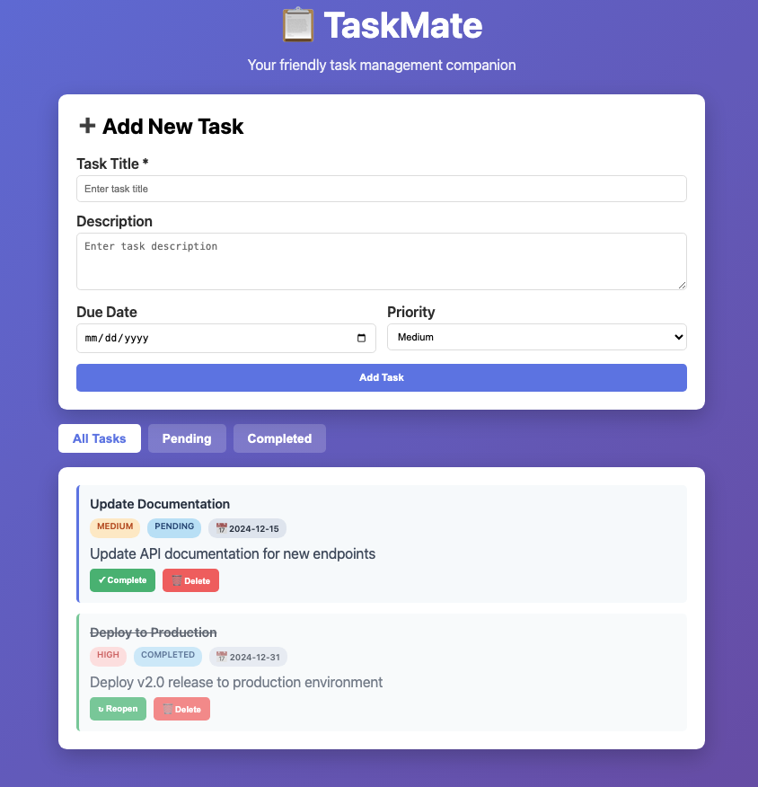

# TaskMate API - A REST API in Go

TaskMate is a task management application built in Go that demonstrates HTTP servers, JSON persistence, authentication, and concurrent data access. Tasks are stored in a JSON file with support for due dates, priorities, and status tracking.



## What You'll Learn

- Building REST APIs in Go
- HTTP routing with Gorilla Mux
- JSON serialization/deserialization and file persistence
- Basic authentication with API keys
- Thread-safe data structures
- Go structs and methods
- File I/O operations

## Architecture Overview

### Core Components

1. **Task Struct**: Represents a task with due date, priority, and status
2. **TaskStore**: Thread-safe storage with JSON file persistence
3. **Server**: HTTP server with authentication middleware
4. **Router**: URL routing and endpoint handling

## Code Walkthrough

### 1. Data Models

```go
type Task struct {
    ID          int       `json:"id"`
    Title       string    `json:"title"`
    Description string    `json:"description"`
    DueDate     string    `json:"due_date"`
    Priority    string    `json:"priority"`    // low, medium, high
    Status      string    `json:"status"`      // pending, completed
    CreatedAt   time.Time `json:"created_at"`
    UpdatedAt   time.Time `json:"updated_at"`
}
```

**What's happening here?**
- We define a `Task` struct with JSON tags for API responses
- JSON tags tell Go how to convert between Go structs and JSON
- `json:"id"` means the `ID` field becomes `"id"` in JSON
- Additional fields track due dates, priority levels, and task status

### 2. Thread-Safe Storage with Persistence

```go
type TaskStore struct {
    mu       sync.RWMutex  // Read-Write mutex for thread safety
    tasks    map[int]*Task // In-memory storage
    nextID   int           // Auto-incrementing ID counter
    filePath string        // JSON file path
}
```

**Why thread-safe with persistence?**
- HTTP servers handle multiple requests simultaneously
- Without locks, concurrent access could corrupt data
- `sync.RWMutex` allows multiple readers OR one writer
- Data persists to JSON file after each write operation
- On startup, tasks are loaded from the JSON file

### 3. CRUD Operations with File Persistence

The TaskStore implements Create, Read, Update, Delete operations:

- **Add()**: Creates new tasks with auto-incrementing IDs and saves to file
- **Get()**: Retrieves a single task by ID
- **GetAll()**: Returns all tasks as a slice
- **GetPending()**: Returns only pending tasks
- **Update()**: Modifies existing tasks and saves to file
- **Delete()**: Removes tasks from storage and updates file
- **loadFromFile()**: Loads tasks from JSON on startup
- **saveToFile()**: Persists tasks to JSON after modifications

### 4. HTTP Server & Token-Based Authentication

TaskMate uses a secure token-based authentication system:

```go
func (s *Server) tokenAuthMiddleware(next http.HandlerFunc) http.HandlerFunc {
    return func(w http.ResponseWriter, r *http.Request) {
        token := r.Header.Get("X-API-Token")
        if token == "" {
            http.Error(w, "Token required", http.StatusUnauthorized)
            return
        }
        
        // Hash and validate token
        tokenHash := hashString(token)
        // Check against stored token hashes
        ...
    }
}
```

**Authentication Flow:**
1. **Password Protection**: Master password required to generate tokens
2. **Token Generation**: Users request tokens by providing the password
3. **Token Usage**: Tokens required for write operations (POST/PUT/DELETE)
4. **Hash Storage**: All passwords and tokens stored as SHA-256 hashes
5. **No Auth for Reads**: GET requests remain open for easy access

**Security Features:**
- Passwords and tokens never stored in plain text
- SHA-256 hashing for all sensitive data
- Multiple tokens supported for different users/applications
- Thread-safe token validation

### 5. JSON Handling

```go
// Reading JSON from request
var req struct {
    Title       string `json:"title"`
    Description string `json:"description"`
}
json.NewDecoder(r.Body).Decode(&req)

// Writing JSON response
json.NewEncoder(w).Encode(todo)
```

**JSON Processing:**
- `json.NewDecoder()` reads JSON from HTTP request body
- `json.NewEncoder()` writes Go structs as JSON to HTTP response
- Go automatically handles the conversion using struct tags

## API Endpoints

| Method | Endpoint | Description | Auth Required |
|--------|----------|-------------|---------------|
| GET | `/health` | Health check | None |
| POST | `/api/v1/auth/token` | Generate API token | Password |
| GET | `/api/v1/tasks` | Get all tasks | None |
| GET | `/api/v1/tasks/pending` | Get pending tasks only | None |
| GET | `/api/v1/tasks/{id}` | Get specific task | None |
| POST | `/api/v1/tasks` | Create new task | Token |
| PUT | `/api/v1/tasks/{id}` | Update task | Token |
| DELETE | `/api/v1/tasks/{id}` | Delete task | Token |

## Running the Application

1. **Install dependencies:**
   ```bash
   go mod tidy
   ```

2. **Create configuration file:**
   ```bash
   cp config.json.example config.json
   ```
   
   Or create `config.json` manually:
   ```json
   {
     "port": "8080",
     "password_hash": "ea424017c57b0d0b2f262edd821dca2dc3cfcbb47e296a9007415af86bbc6ac1",
     "token_hashes": []
   }
   ```
   
   Default password is "randomforest". To use a different password, generate its SHA-256 hash:
   ```bash
   echo -n "your_password" | shasum -a 256
   ```

3. **Run the server:**
   ```bash
   go run main.go
   ```

4. **Access the Web UI:**
   
   Open your browser and visit: **http://localhost:8080**
   
   The UI provides:
   - ✨ Beautiful, responsive interface
   - ➕ Add tasks with title, description, due date, and priority
   - 📋 View all tasks, pending tasks, or completed tasks
   - ✓ Mark tasks as complete or reopen them
   - 🗑 Delete tasks
   - 🔄 Real-time updates when tasks are added/removed

4. **Test the API (Optional):**

   **Step 1: Generate an API Token**
   
   First, generate a token using the master password (default: "randomforest"):
   
   ```bash
   curl -X POST http://localhost:8080/api/v1/auth/token \
     -H "Content-Type: application/json" \
     -d '{"password": "randomforest"}'
   ```
   
   Response:
   ```json
   {
     "token": "a1b2c3d4e5f6...",
     "message": "Token generated successfully. Save this token securely, it won't be shown again."
   }
   ```
   
   **Important:** Save the token! It's only shown once and cannot be retrieved later.
   
   **Step 2: Use the Token for API Requests**
   
   ```bash
   # Health check (no auth needed)
   curl http://localhost:8080/health
   
   # Get all tasks (no auth needed)
   curl http://localhost:8080/api/v1/tasks
   
   # Get pending tasks only (no auth needed)
   curl http://localhost:8080/api/v1/tasks/pending
   
   # Create a task (requires token)
   curl -X POST http://localhost:8080/api/v1/tasks \
     -H "X-API-Token: YOUR_TOKEN_HERE" \
     -H "Content-Type: application/json" \
     -d '{"title": "Deploy to Production", "description": "Deploy v2.0 release", "due_date": "2024-12-31", "priority": "high"}'
   
   # Update a task (requires token)
   curl -X PUT http://localhost:8080/api/v1/tasks/1 \
     -H "X-API-Token: YOUR_TOKEN_HERE" \
     -H "Content-Type: application/json" \
     -d '{"title": "Deploy to Production", "description": "Deploy v2.0 release", "due_date": "2024-12-31", "priority": "high", "status": "completed"}'
   
   # Delete a task (requires token)
   curl -X DELETE http://localhost:8080/api/v1/tasks/1 \
     -H "X-API-Token: YOUR_TOKEN_HERE"
   ```

## Key Go Concepts Demonstrated

### 1. Structs and Methods
- Structs group related data
- Methods are functions attached to types
- Pointer receivers (`*TodoStore`) allow modification

### 2. Interfaces
- `http.HandlerFunc` is a function type that implements `http.Handler`
- Interfaces define behavior contracts

### 3. Goroutines and Concurrency
- HTTP server automatically handles requests in separate goroutines
- Mutexes prevent race conditions

### 4. Error Handling
- Go uses explicit error returns
- HTTP errors are handled with appropriate status codes

### 5. Package Management
- `go.mod` defines module dependencies
- Import statements bring in external packages

### 6. File I/O
- `os.ReadFile()` reads JSON data on startup
- `os.WriteFile()` persists data after modifications
- `json.Marshal()` converts structs to JSON
- `json.Unmarshal()` converts JSON to structs

## Authentication & Security

### Token-Based Authentication

TaskMate uses a two-tier authentication system:

1. **Password Authentication** (for token generation only)
   - Master password stored as SHA-256 hash in `config.json`
   - Required only when generating new tokens
   - Default password: "randomforest"

2. **Token Authentication** (for write operations)
   - Tokens required for POST, PUT, DELETE operations
   - GET requests remain open (no authentication needed)
   - Tokens stored as SHA-256 hashes in `config.json`
   - Multiple tokens supported for different users/applications

### Configuration File

The `config.json` file stores authentication data:

```json
{
  "api_key": "add-token",
  "port": "8080",
  "password_hash": "ea424017c57b0d0b2f262edd821dca2dc3cfcbb47e296a9007415af86bbc6ac1",
  "token_hashes": [
    "hash_of_token_1",
    "hash_of_token_2"
  ]
}
```

- `password_hash`: SHA-256 hash of master password (default: "randomforest")
- `token_hashes`: Array of SHA-256 hashes of generated tokens

### Changing the Master Password

To change the password, generate a new SHA-256 hash:

```bash
# On macOS/Linux
echo -n "your_new_password" | shasum -a 256

# On Windows (PowerShell)
$password = "your_new_password"
$hash = [System.Security.Cryptography.SHA256]::Create().ComputeHash([System.Text.Encoding]::UTF8.GetBytes($password))
[System.BitConverter]::ToString($hash).Replace("-", "").ToLower()
```

Then update the `password_hash` field in `config.json`.

### Security Features

- **No Plain Text Storage**: Passwords and tokens never stored in plain text
- **SHA-256 Hashing**: Industry-standard cryptographic hashing
- **Token Isolation**: Each user/application can have their own token
- **Input Validation**: Check for required fields and valid data
- **HTTP Status Codes**: Proper codes for different scenarios
- **Thread Safety**: Prevent data races with mutexes
- **File Permissions**: Config and data files created with 0644 permissions

## Data Persistence

Tasks are automatically saved to `tasks.json` in the current directory:

```json
[
  {
    "id": 1,
    "title": "Deploy to Production",
    "description": "Deploy v2.0 release",
    "due_date": "2024-12-31",
    "priority": "high",
    "status": "pending",
    "created_at": "2024-01-15T10:30:00Z",
    "updated_at": "2024-01-15T10:30:00Z"
  }
]
```

## Next Steps

- Add database storage (PostgreSQL, MongoDB)
- Implement user management and authentication
- Add request logging and monitoring
- Create unit and integration tests
- Add configuration management
- Implement task filtering and search

## Docker Deployment

### Building and Running with Docker

1. **Build the Docker image:**
   ```bash
   docker build -t taskmate:latest .
   ```

2. **Run with Docker:**
   ```bash
   docker run -d \
     -p 8080:8080 \
     -e TASKMATE_PASSWORD_HASH=ea424017c57b0d0b2f262edd821dca2dc3cfcbb47e296a9007415af86bbc6ac1 \
     -v $(pwd)/tasks.json:/app/tasks.json \
     -v $(pwd)/config.json:/app/config.json \
     --name taskmate \
     taskmate:latest
   ```

3. **Or use Docker Compose:**
   ```bash
   docker-compose up -d
   ```

### Environment Variables for Containers

The application supports these environment variables for containerized deployments:

- `TASKMATE_PORT`: Server port (default: 8080)
- `TASKMATE_API_KEY`: Legacy API key (optional)
- `TASKMATE_PASSWORD_HASH`: SHA-256 hash of master password (required for production)

**Generate password hash for production:**
```bash
# On macOS/Linux
echo -n "your_secure_password" | shasum -a 256

# Use the output as TASKMATE_PASSWORD_HASH
```

### Configuration Priority

1. Environment variables (highest priority - for containers)
2. config.json file (if exists)
3. Default values (lowest priority)

This allows you to:
- Use `config.json` for local development
- Use environment variables for Docker/Kubernetes deployments
- Commit `config.json.example` to git without exposing secrets

This task management API serves as a foundation for understanding Go web development and prepares you for building more complex applications and tools like Terraform providers!

## Development & CI/CD

### Running Tests

```bash
# Run all tests
go test -v ./...

# Run tests with coverage
go test -v -race -coverprofile=coverage.out ./...

# View coverage report
go tool cover -html=coverage.out
```

### Linting

```bash
# Install golangci-lint
go install github.com/golangci/golangci-lint/cmd/golangci-lint@latest

# Run linter
golangci-lint run
```

### Docker

```bash
# Build image
docker build -t taskmate:latest .

# Run container
docker run -p 8080:8080 taskmate:latest

# Run with custom config
docker run -p 8080:8080 -v $(pwd)/config.json:/root/config.json taskmate:latest
```

### GitHub Actions

The project includes automated CI/CD pipelines:

- **CI Pipeline** (on PR and push):
  - Linting with golangci-lint
  - Unit tests with race detection
  - Build verification
  - Integration tests

- **Release Pipeline** (on tag push):
  - Multi-platform binary builds
  - Docker image builds
  - Automated GitHub releases
  - Changelog generation

### Creating a Release

See [VERSIONING.md](VERSIONING.md) for detailed versioning guidelines.

Quick start:
```bash
# Beta release
git tag v0.1.0-beta.1
git push origin v0.1.0-beta.1

# This triggers automatic:
# - Binary builds for Linux, macOS, Windows
# - Docker image builds
# - GitHub release creation
```

## License

MIT License - see LICENSE file for details.